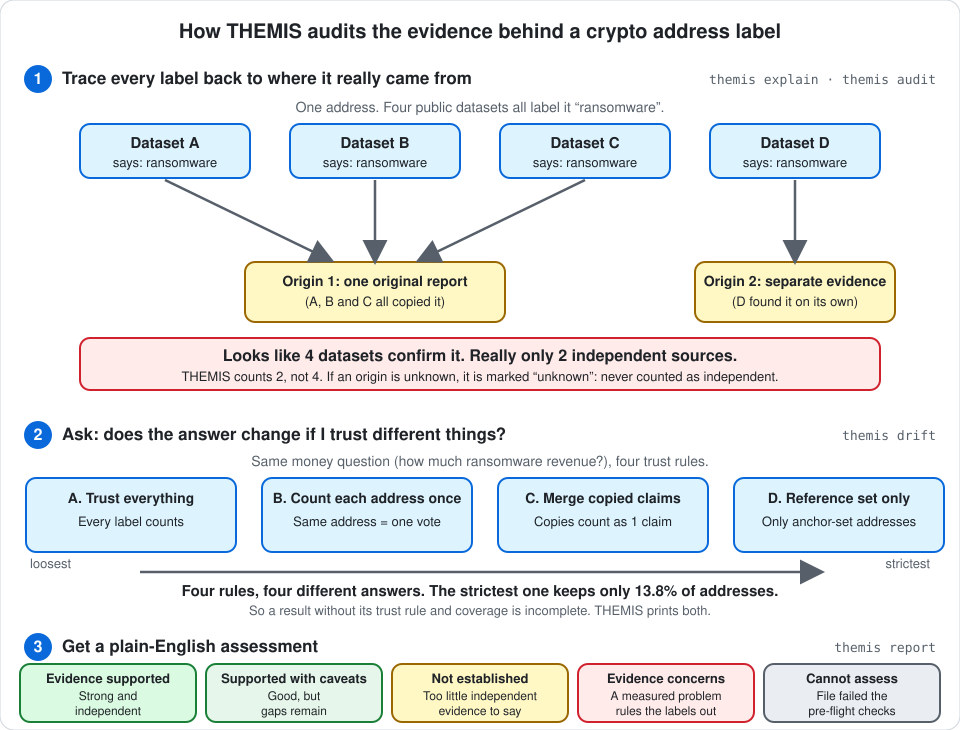

# THEMIS

**Measuring how much evidence really stands behind a public "this crypto address belongs to X" label.**



## What it is

A blockchain shows **transfers**, not **people**. "This address is a scam" is always someone's *claim*, and those claims come from a handful of public datasets that copy from each other. Ten datasets saying the same thing can be **one** opinion repeated ten times.

THEMIS is a measurement and audit tool. It does not label addresses. It checks:

1. **Where** each label came from (its provenance root).
2. **Whether** agreement between datasets is real or inherited.
3. **How much** a forensic answer changes when you trust different things.

Built for the paper *Provenance Before Precision: Auditing Public Bitcoin Attribution Labels and Their Effect on Forensic Conclusions* (ICISHCT 2026).

## What it does **not** say

- A label being public does not make it **true**.
- Passing a trust rule means the evidence meets that bar, not that the label is **correct**.
- Many datasets agreeing does not mean many **independent** sources.
- No outcome here proves a label right. It judges the evidence, not a single address.

## Quick start

Needs Python 3.10+ (Node 18+ only for the dashboard).

```
git clone https://github.com/anubhavmohandas/themis && cd themis
python -m venv .venv && source .venv/bin/activate
pip install -e ".[test]"

themis ingest examples/example_attribution.csv --source-id demo --no-reference
```

You get a plain-English assessment, starting like this:

```
According to the THEMIS report, the assessment of this dataset is EVIDENCE CONCERNS.
  because:
    x 1 of 11 addresses (9.1%) carry labels in this file that contradict each other.
    + All 12 rows carried a valid identifier.
    - No reference corpus was supplied, so the labels were not tested against any other public source.
```

The five possible outcomes are `EVIDENCE SUPPORTED`, `SUPPORTED WITH CAVEATS`, `NOT ESTABLISHED`, `EVIDENCE CONCERNS` and `CANNOT ASSESS`.

Web dashboard: `pip install -e ".[ui]"`, then `python run.py`.

## What you can do

| I want to… | Run | Details |
|---|---|---|
| Audit my own CSV of address labels | `themis ingest FILE --source-id NAME` | [Audit your own data](docs/wiki/your-own-data.md) |
| See how much sources really agree | `themis audit` | [Reproduce the paper](docs/wiki/reproduce-the-paper.md) |
| See how the answer moves with the trust rule | `themis drift` | [The ideas](docs/wiki/concepts.md) |
| Trace one address back to its origin | `themis explain <address>` | [Install and use](docs/wiki/install-and-use.md) |
| Re-check the paper's numbers | `themis reproduce-paper`, `themis verify-paper` | [Reproduce the paper](docs/wiki/reproduce-the-paper.md) |

`audit`, `drift` and `explain` need the reference corpus (next section); `ingest` works without it.

## The paper and its data

- The release `v1.0-paper` is the artifact of the final ICISHCT 2026 manuscript. The manuscript itself is not distributed; [`paper/paper_claims.yml`](paper/paper_claims.yml) pins its SHA-256.
- **No third-party records are shipped**, because the redistribution terms of the underlying sources are not uniform. `demo_data/` holds only a README.
- To reproduce the paper, fetch the seven sources yourself, rebuild the corpus with `scripts/build_corpus.py` and run `themis reproduce-paper`. Source locations, hashes and expected outputs are in [REPRODUCE.md](REPRODUCE.md) and [THIRD_PARTY_DATA.md](THIRD_PARTY_DATA.md).
- Exact reproduction of the Ransomwhere-dependent figures needs the author's retained, hashed 2026 export, because the live service changes.

## Documentation

Full detail is in [docs/wiki/](docs/wiki/README.md):

- [The ideas behind THEMIS](docs/wiki/concepts.md): evidence tiers, provenance, trust rules
- [Install and use](docs/wiki/install-and-use.md): setup, commands, dashboard, architecture
- [Audit your own data](docs/wiki/your-own-data.md): upload flow, pre-flight checks, limits, security
- [Reproduce the paper](docs/wiki/reproduce-the-paper.md): step by step, and how the paper is verified
- [Data and licences](docs/wiki/data-and-licenses.md): what is and is not shipped
- [Testing and known limits](docs/wiki/testing-and-limits.md): what is tested, what is not
- [Project layout and citation](docs/wiki/project-layout.md)

## Licence and citation

THEMIS's code is MIT ([LICENSE](LICENSE)). It grants no rights over third-party datasets; see [Data and licences](docs/wiki/data-and-licenses.md). Until the paper has a final reference, cite it by title.

---

<sub>Made with ❤️ by Anubhav Mohandas</sub>
